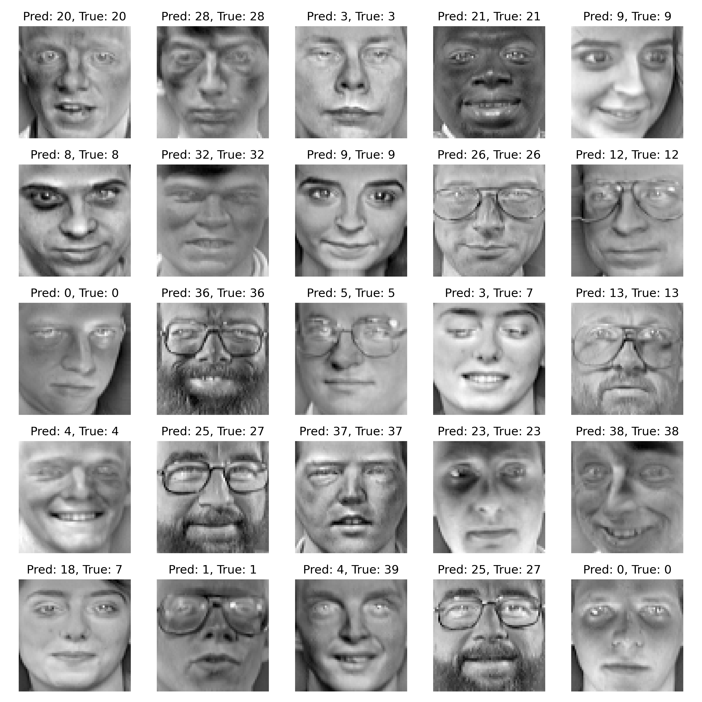

# Face Recognition Project

## Project Overview
This project implements a face recognition model using the Olivetti Faces dataset. The goal is to classify different individuals using machine learning techniques. The project leverages Principal Component Analysis (PCA) for dimensionality reduction and k-Nearest Neighbors (k-NN) as the classifier.

## Dataset
- **Name**: Olivetti Faces Dataset
- **Source**: Scikit-Learn
- **Description**: A dataset of 400 grayscale images (64x64) of faces from 40 different individuals.

## Setup and Installation

### 1. Running with Docker

To streamline dependencies and ensure consistent environments, the project is Dockerized.

1. **Build the Docker Image**:
   ```bash
   docker build -t face-recognition-project .
   ```

2. **Create Volumes for Data and Results**:
   To store data and results outside of the container, create persistent volumes:
   ```bash
   docker volume create face_recognition_data
   docker volume create face_recognition_results
   ```

3. **Run the Docker Container**:
   This command will execute all the scripts (data processing, model training, and visualization) and output results:
   ```bash
   docker run --rm -it \
       -v face_recognition_data:/app/data \
       -v face_recognition_results:/app/results \
       face-recognition-project
   ```
   - **Results**: Output files will be available in the `face_recognition_results` volume, including `predictions.png` and `model_results.json`.

4. **Access Jupyter Notebook** (optional):
   To explore the Jupyter notebook in the project:
   ```bash
   docker run --rm -it \
       -v face_recognition_data:/app/data \
       -v face_recognition_results:/app/results \
       -p 8888:8888 \
       face-recognition-project \
       jupyter notebook --ip 0.0.0.0 --no-browser --allow-root
   ```
   - **Notebook Access**: Open the URL shown in the terminal, which includes a token for accessing the notebook interface.
   - **Find the Token**: If needed, you can find the token in the Docker container logs.

### 2. Running Locally

If you prefer running the project locally without Docker:

**Requirements**: Python 3, pip

1. **Clone this repository**:
   ```bash
   git clone [your repo link]
   cd face-recognition-project
   ```

2. **Create a virtual environment** (recommended for isolating dependencies):
   ```bash
   python3 -m venv venv
   ```

3. **Activate the virtual environment**:
   - On **macOS and Linux**:
     ```bash
     source venv/bin/activate
     ```
   - On **Windows**:
     ```bash
     venv\Scripts\activate
     ```

4. **Install required dependencies**:
   ```bash
   pip install -r requirements.txt
   ```

5. **Run the project**:
   - To execute the full pipeline (data loading, training, and evaluation), run:
     ```bash
     python src/model_training.py
     ```

6. **Run Jupyter Notebook**:
   ```bash
   jupyter notebook notebooks/Face_Recognition_with_Olivetti_Faces.ipynb
   ```

### Project Structure

```plaintext
face-recognition-project/
├── data/                  # Directory for storing data
├── notebooks/             # Jupyter notebooks (optional)
│   └── Face_Recognition_with_Olivetti_Faces.ipynb
├── src/                   # Source code for the project
│   ├── data_processing.py # Script for loading and processing data
│   ├── model_training.py  # Script for model training and evaluation
│   └── visualize.py       # Script for visualizing results
├── results/               # Directory to store results, plots, and model outputs
│   └── predictions.png    # Example predictions output file
├── README.md              # Project overview and setup instructions
└── requirements.txt       # List of Python dependencies
```

### Description of Key Scripts in `src/`:

- **data_processing.py**: Loads and preprocesses the Olivetti Faces dataset, caching it locally.
- **model_training.py**: Performs cross-validation and a train-test split to evaluate model accuracy, saving results to JSON.
- **visualize.py**: Generates a `predictions.png` file with predicted and true labels for sample images from the test set.

## Results
- **Accuracy**: Achieved ~85% cross-validated accuracy with k-NN and PCA.
- **Visualizations**: Predictions are saved in the `results/` directory as `predictions.png`.

Example predictions (from `predictions.png`):



## Deactivating the Virtual Environment
When you're finished with the project, deactivate the virtual environment by running:
```bash
deactivate
```
```